# **PickUp - Web App**

## **Description**

## Purpose

The purpose of our full stack application is to make it easy for casual basketball players to connect with each other and organise games of pickup basketball. Pickup games are casual in nature, with a focus on having fun and practicing skills. Unfortunately, it’s hard to gauge interest in pickup games in many communities, especially if one is new to an area. Our application hopes to resolve this issue, promoting social interaction and healthy lifestyles around Australia.

## Functionality/features

There are several key functionalities and features of the app:

- Create listings for pickup basketball games.
  - Location, time and skill level required.
- Users can search for and view pickup games, and register their intent to attend.
  - Can filter by location (suburb), skill level, date posted, most responded to (stretch goal).
- Register local basketball courts.
- See a list of all registered court locations

There are several stretch goals to be added if time permits:

- Google Maps (or another Map API) integration.
  - Connect registered pickup games to their location on a map.
  - Search for games within a radius.
  - View court locations via the map.
- Create user accounts (username/password/profile).
  - Users can link their account with their expression of interest for a registered game.
- Photo uploading of user registered courts.
  - Would requires admin approval.

## Target Audience

Our target audience spans a range of basketball players, from absolute beginners to experienced hoopers, young or old and of any gender. Anyone that has an interest in playing free, unorganised basketball is inclusive of our target audience. Organised basketball requires a weekly time commitment and financial contribution to play, our app aims to help those that may be unable to commit to organised basketball, and allow them to find other avenues to play the sport.  Users will be able to select games that are mixed or unmixed if they have a preference.

## Tech Stack

We are using the MERN stack to build our application. The front-end will be built with HTML, CSS,  JavaScript and React. The back-end will be built with Express and Node.js. Mongoose will be used as our Object Data Modelling library to connect Node.js with our MongoDB NoSQL database. We expect to make extensive use of Trello and Discord for our project management tools. For deployment we will be using Heroku. Git is our version control system of choice, connected to a remote GitHub repository. For designing wireframes abd other diagrams we will use a combination of LucidChart, diagrams.net, and Figma. If time permits we will connect our web app with the Google Maps API.

---

## **User Stories**

- As a casual basketball player, I want to find a way to play basketball games without a longterm financial commitment.
- As a new basketball player, I want to find similarly skilled players to learn to play basketball with.
- As someone who has recently moved to a foreign country, I want to connect and interact with other like-minded basketball enthusiasts.
- As a busy professional, I want to schedule and organise casual basketball games in advance in order to be efficient with my time.
- As a user, I want to express my interest in a pickup listing, so the listing-creator will know I'll be there.
- As a user, I want to search for pickup listings in my area, so I can filter results down to what is relevant to me.
- As a user, I want to view a list of all the registered courts, so I can see what local courts are near me.
- As an admin, I want to approve an image upload so I can create a better court listing.
- As an admin, I want to update a game or court listing, to maintain its accuracy.

---

## **Dataflow Diagram**

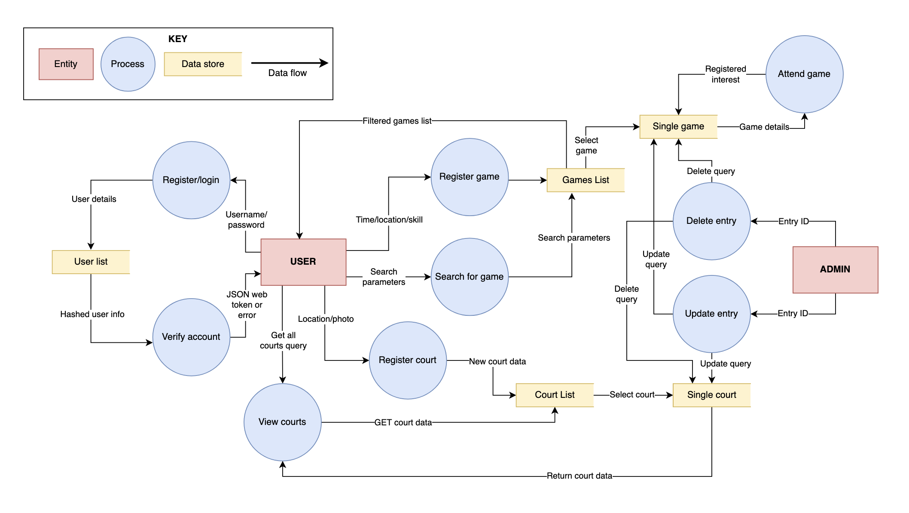

---

## **Application Architecture Diagram**

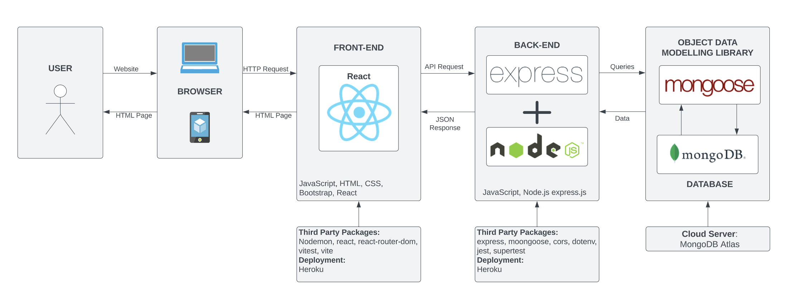

---

## **Wireframes**

### Desktop

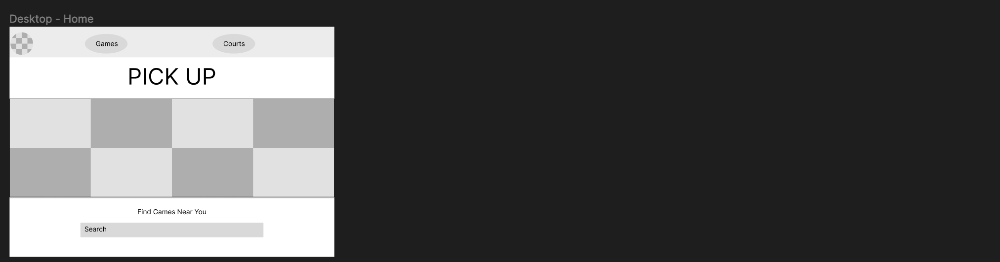
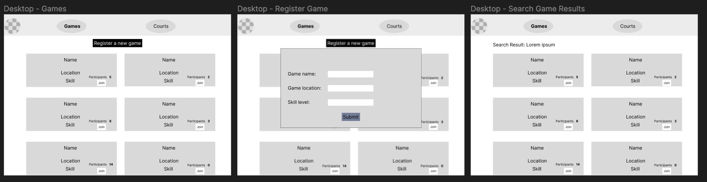
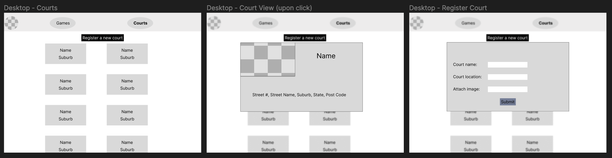

### Tablet

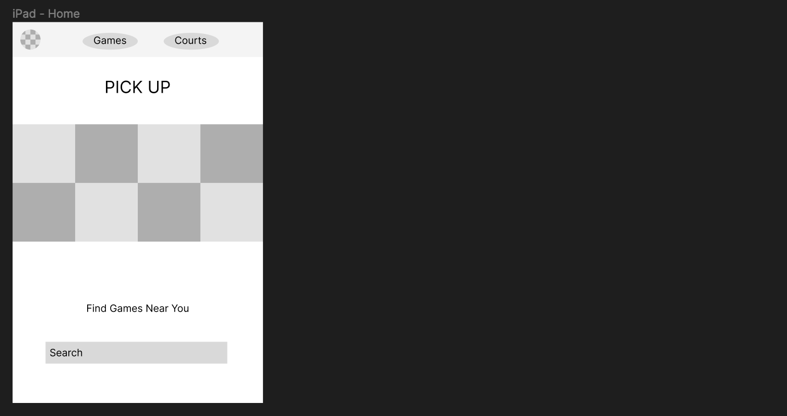
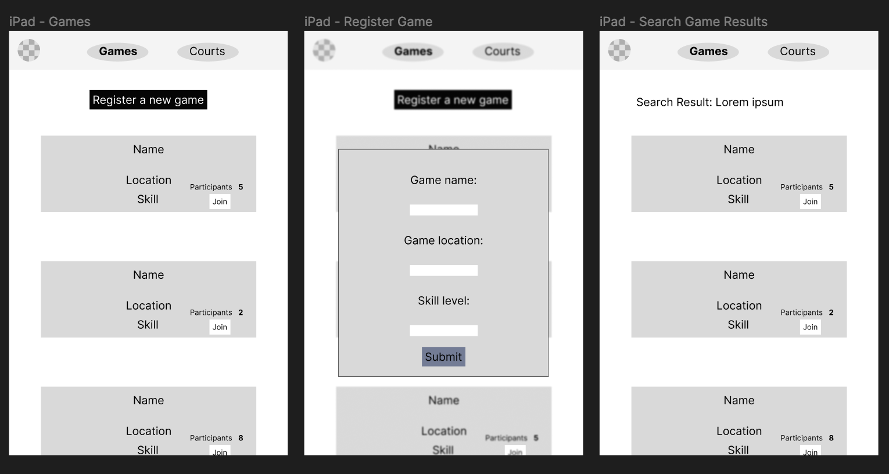
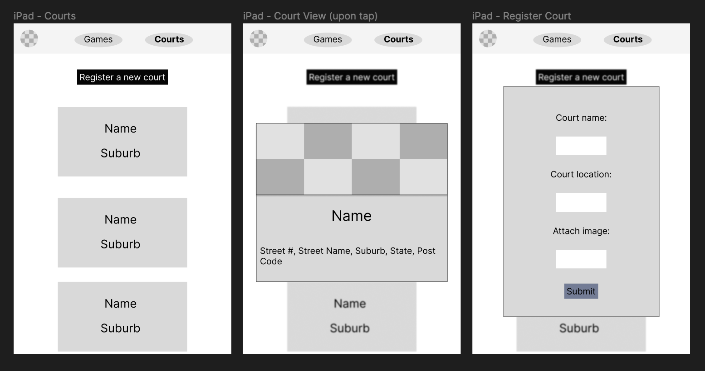

### Mobile

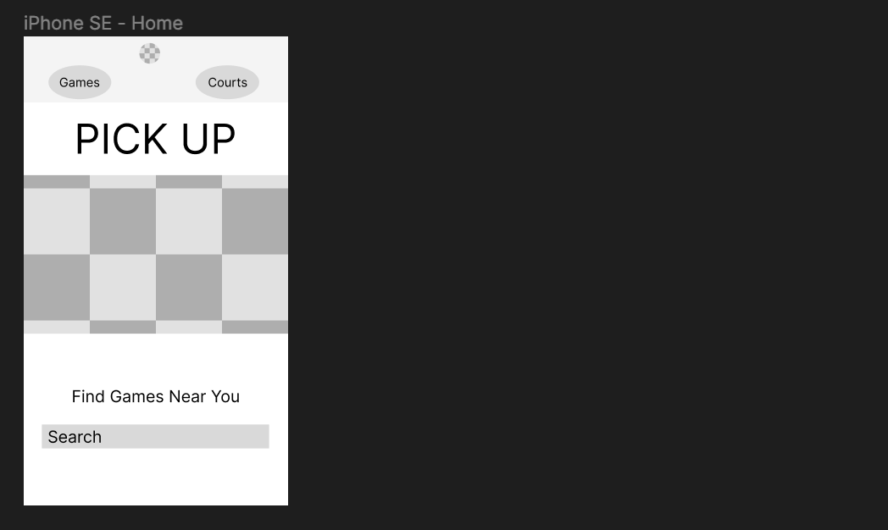
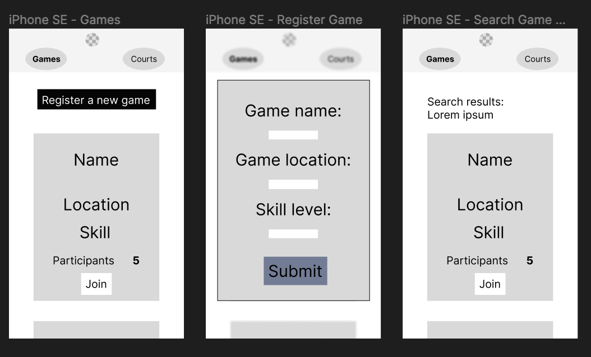
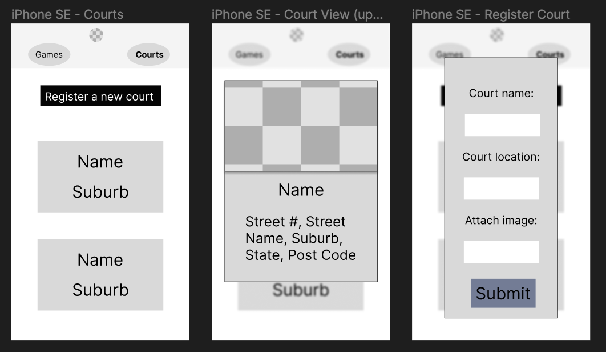

---

## **Trello**

To track and manage the tasks in our project we used Trello. Screenshots from the start of each day have been attached.

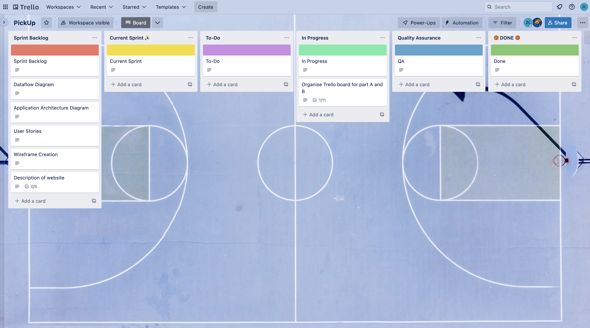

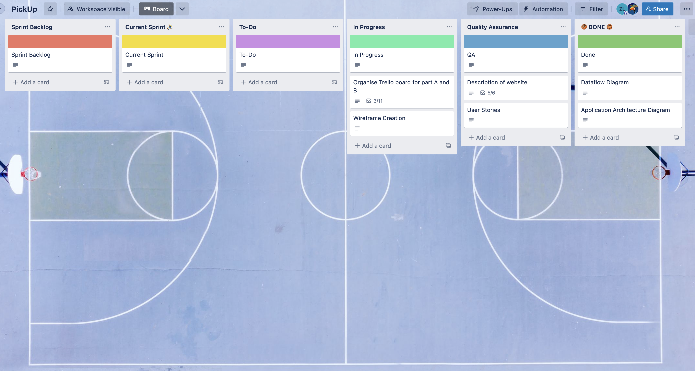
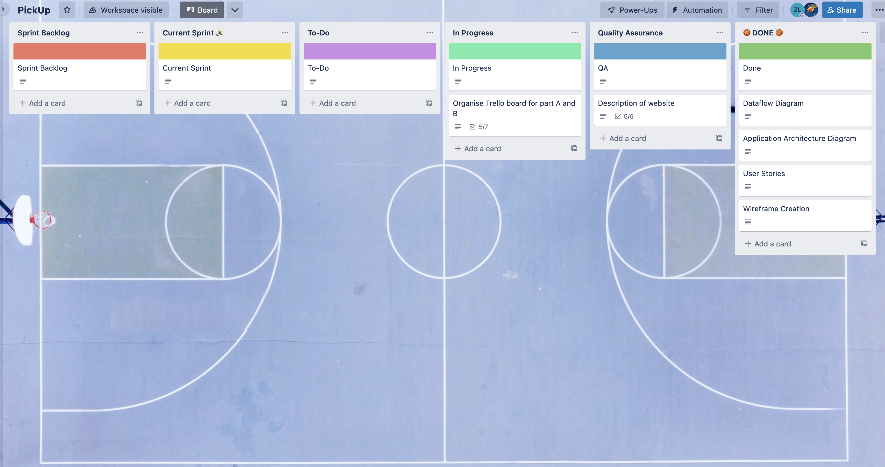
